```markdown
# Client-Server Architecture with MySQL

## Understanding Client-Server Architecture
Client-Server refers to an architecture where two or more computers are connected over a network to send and receive requests. In this architecture:
- The machine sending requests is referred to as the **Client**.
- The machine responding to these requests is referred to as the **Server**.

---

## Task: Implement Client-Server Architecture Using MySQL DBMS

### Objective:
Implement a MySQL-based client-server architecture using AWS EC2 Linux instances.

---

### Prerequisites:
- AWS account with permission to create EC2 instances.
- Basic knowledge of Linux commands and MySQL.
  
### Steps:

### 1. **Create and Configure Two Linux-Based EC2 Instances**

We will create two EC2 instances, one acting as the MySQL Server, and the other as the MySQL Client.

#### a. **Create the EC2 Instances**
1. Go to your AWS Management Console.
2. Launch two new EC2 instances with an **Ubuntu** AMI.
3. Name them:
   - EC2 Instance 1: `mysql-server`
   - EC2 Instance 2: `mysql-client`
4. Ensure both instances are in the same VPC (Virtual Private Cloud) and subnet so they can communicate via private IP addresses.
5. For security purposes, generate a key pair for SSH access.
6. Allocate security groups to allow specific traffic (we will configure this in a later step).
   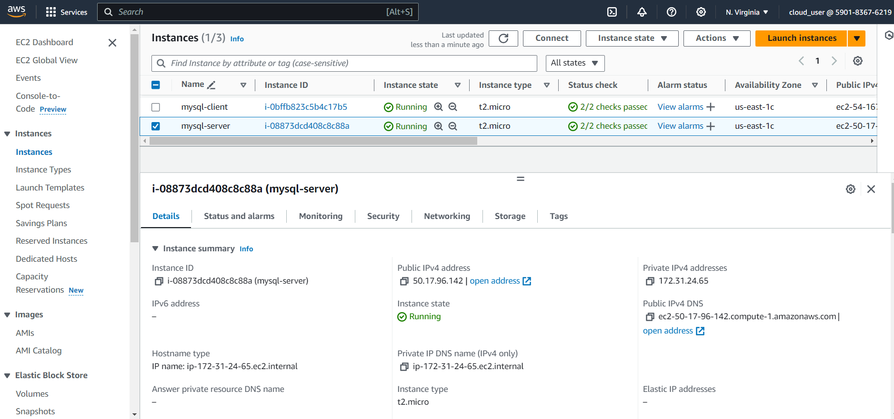

#### b. **Connect to EC2 Instances**
Use your terminal or command line to connect to the EC2 instances using SSH.

```bash
# Replace `your-key.pem` with your key file and IP with the public IP of your EC2 instance
ssh -i your-key.pem ec2-user@<public-ip-address-of-ec2>
```
   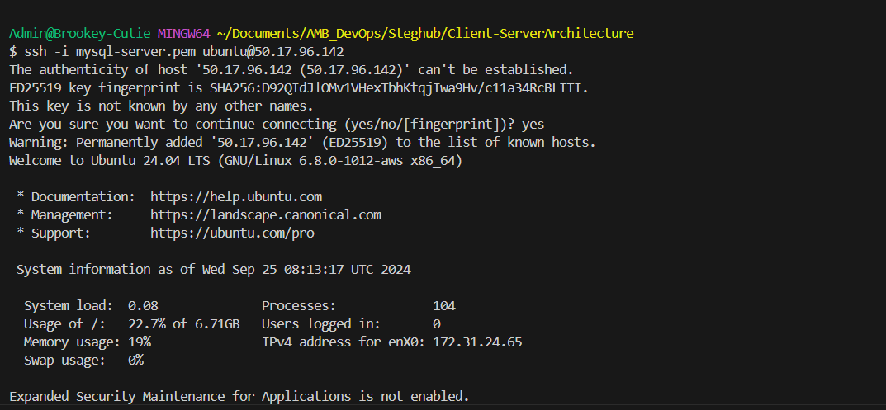

   Open another terminal and connect to the `mysql-client` instance
   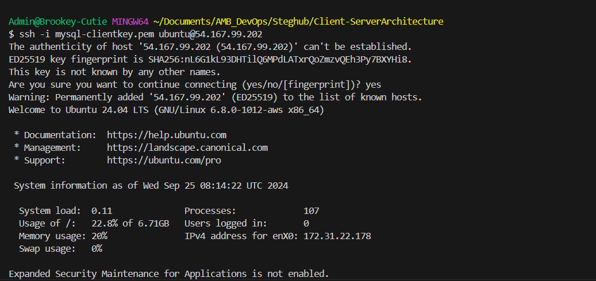

---

### 2. **Install MySQL Server on `mysql-server`**

On the `mysql-server` instance, we will install MySQL Server.

#### a. **Install MySQL Server**

```bash
# Update the package manager
sudo apt update

# Install MySQL Server
sudo apt install mysql-server -y 
```
   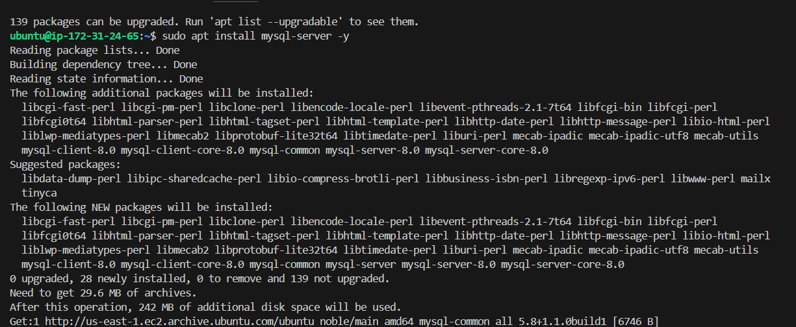

#### b. **Start and Secure MySQL Service**

```bash
# Start MySQL service
sudo systemctl start mysql

# Enable MySQL to start on boot
sudo systemctl enable mysql

# Run the security script to remove default settings
sudo mysql_secure_installation
```
Follow the prompts to set a root password and secure the installation.
   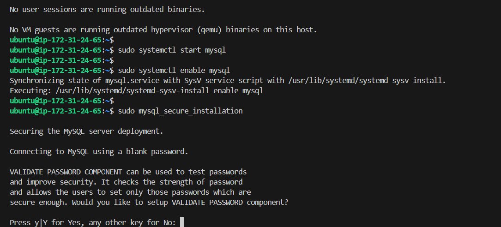

---

### 3. **Install MySQL Client on `mysql-client`**

On the `mysql-client` instance, install MySQL Client.

```bash
# Update the package manager
sudo apt update 

# Install MySQL Client
sudo apt install mysql-client -y  
```
   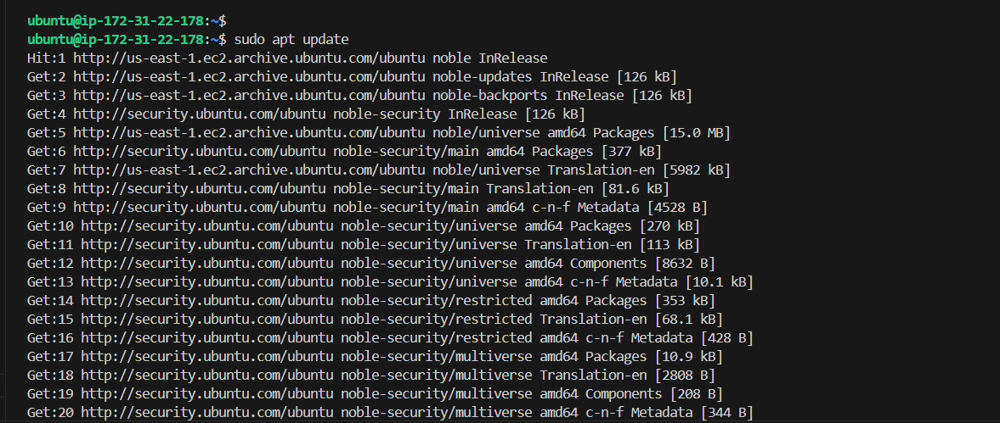
   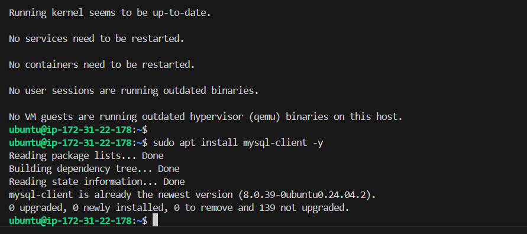

---

### 4. **Allow MySQL Server Access from `mysql-client`**

#### a. **Configure Security Group**
By default, MySQL uses TCP port **3306**. To allow `mysql-client` to access `mysql-server`, we need to open port 3306.

1. Go to AWS Management Console.
2. Navigate to **EC2 > Security Groups**.
3. Find the security group attached to `mysql-server`.
4. Edit the **Inbound rules**:
   - Protocol: TCP
   - Port Range: 3306
   - Source: The **private IP address** of your `mysql-client` instance.
   
5. Save the settings.
   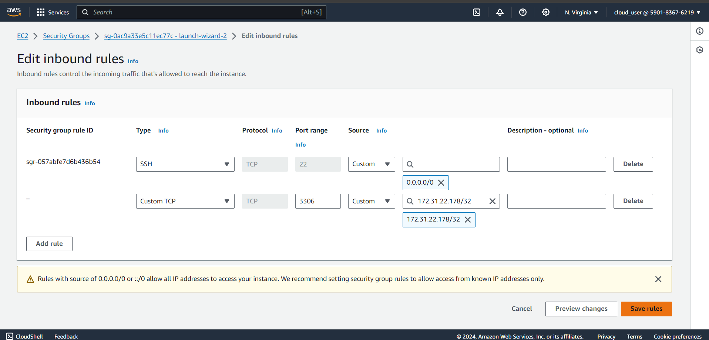

#### b. **Edit MySQL Configuration to Allow Remote Connections**

On `mysql-server`, open the MySQL configuration file and allow connections from remote hosts.

```bash
sudo vi /etc/mysql/mysql.conf.d/mysqld.cnf 
```

- Locate the line:
  
  ```
  bind-address = 127.0.0.1
  ```

- Change `127.0.0.1` to `0.0.0.0`:

  ```
  bind-address = 0.0.0.0
  ```

- Save and close the file.
   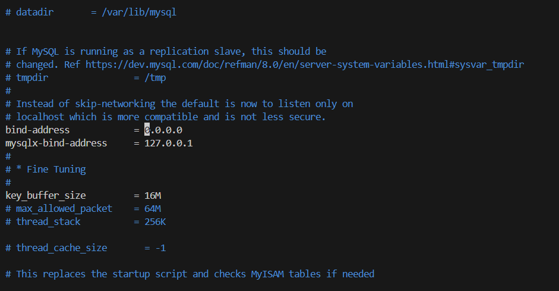

#### c. **Restart MySQL Service**

```bash
sudo systemctl restart mysql
```
   

---

### 5. **Connect Remotely from `mysql-client` to `mysql-server`**

Now, from the `mysql-client` instance, connect to the MySQL database on the `mysql-server` using the private IP.

#### a. **Get MySQL Server Private IP**
- Run the following command on `mysql-server` to get its private IP address:

```bash
hostname -I
```
   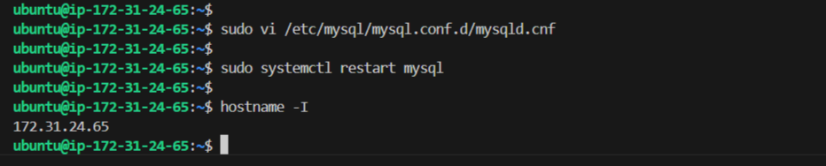

#### b. **Connect Using MySQL Client**

On the `mysql-client` instance, use the MySQL Client utility to connect:

```bash
mysql -u root -p -h <private-ip-of-mysql-server>
```

When prompted, enter the root password set during the MySQL installation.

   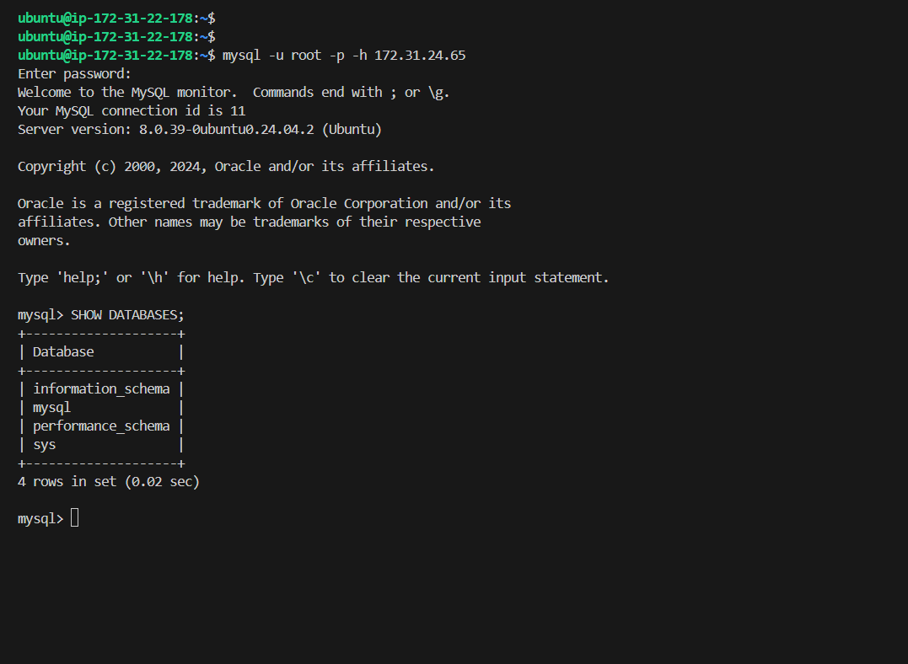

### Error
1.  
    The error ERROR 1130 (HY000): Host 'ip-172-31-22-178.ec2.internal' is not allowed to connect to this MySQL server occurs because the MySQL server is not configured to accept connections from remote hosts. To resolve this,I needed to grant access to the MySQL client host (mysql-client) from the MySQL server (mysql-server), by using this command:

    ```bash
    GRANT ALL PRIVILEGES ON *.* TO 'root'@'172.31.22.178' IDENTIFIED BY 'your_root_password' WITH GRANT OPTION;
    ```
    But Then I ran into another error, as seen below:
2.  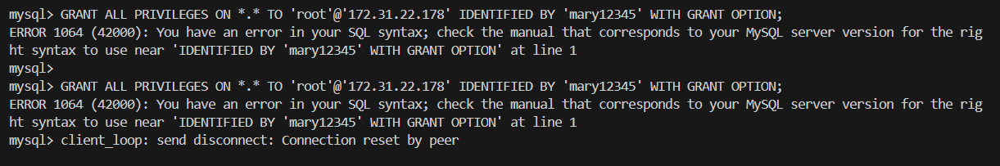
    The error indicates there was an issue with the SQL syntax used. 
    Starting from MySQL 8.0, the `IDENTIFIED BY` clause is no longer valid within the `GRANT` statement. 
    One need to create the user and set the password using separate commands.

    Here’s how I fixed this:

### Solution

1. **Create or Update the User First**

Run this command to create or update the `root` user for the remote client IP (`172.31.22.178`) and set the password:

```sql
CREATE USER 'root'@'172.31.22.178' IDENTIFIED BY 'mary12345';
```

If the user already exists, you can modify it using:

```sql
ALTER USER 'root'@'172.31.22.178' IDENTIFIED BY 'mary12345';
```

2. **Grant Privileges to the User**

After creating or updating the user, you can grant privileges:

```sql
GRANT ALL PRIVILEGES ON *.* TO 'root'@'172.31.22.178' WITH GRANT OPTION;
```

3. **Flush Privileges**

Finally, run this command to apply the changes:

```sql
FLUSH PRIVILEGES;
```

### Final Steps
Now, you should be able to connect from the remote host (`172.31.22.178`) using the `root` user with the password `mary12345`.

```bash
mysql -u root -p -h 172.31.24.65
```

When prompted, enter the password `mary12345`.
   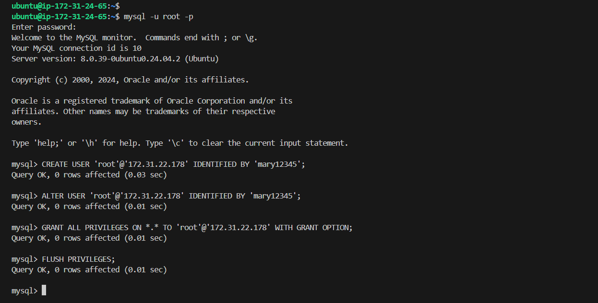

---

### 6. **Test the Connection by Running SQL Queries**

Once connected, verify the connection by running a simple SQL query:

```sql
SHOW DATABASES;
```
   

You should see an output listing the default databases. If successful, you have completed the MySQL client-server setup!

---

### 7. **Practice SQL Operations**
Feel free to practice basic SQL operations like creating databases, tables, and running queries:

#### a. **Create a Database**

```sql
CREATE DATABASE testdb;
```

#### b. **Create a Table**

```sql
USE testdb;

CREATE TABLE users (
    id INT AUTO_INCREMENT PRIMARY KEY,
    name VARCHAR(100),
    email VARCHAR(100)
);
```

#### c. **Insert Data into Table**

```sql
INSERT INTO users (name, email) VALUES ('Mary Ajayi', 'mary@ajayi.com');
```

#### d. **Select Data from Table**

```sql
SELECT * FROM users;
```
   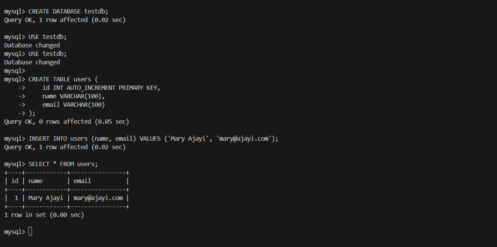

---

## Congratulations!
We have successfully deployed a fully functional **MySQL Client-Server Architecture** on AWS. 
```